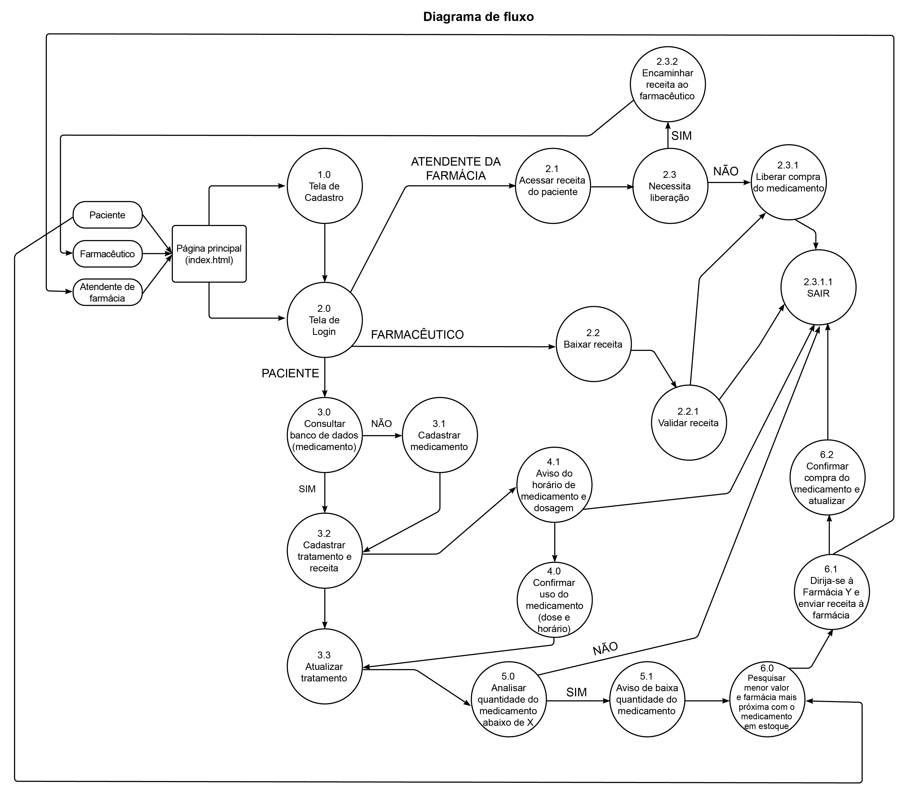

# Projeto de Interface

Pré-requisitos: <a href="2-Especificação do Projeto.md"> Documentação de Especificação</a>

A interface do Minha Saúde foi pensada de forma a facilitar a usabilidade. Com foco na simplicidade, cada função deverá ficar evidenciada nas respectivas telas, e os caminhos para a execução de cada ação devem ser intuitivos. Na figura abaixo, uma imagem da tela principal.

Da figura pode-se também notar que o desenvolvimento da aplicação seguirá a o conceito *Mobile First*, que consiste no foco em estrutura mobile, isto é, cada tela é elaborada primeiramente para telas menores, de celular, e depois serão adaptadas para telas maiores.

O desenvolvimento da interface foi construído como protótipo de baixa fidelidade, determinando-se a estrutura de cada dela, logotipo e paleta de cores.

O protótipo também foi elaborado com interatividade. Todas as telas e o fluxo entre elas pode ser visto no link <a href="https://www.figma.com/proto/zISLLKX16ilEhbkGP7Wgka/Minha-Sa%C3%BAde?node-id=55%3A2&scaling=scale-down&page-id=0%3A1&starting-point-node-id=55%3A2&show-proto-sidebar=1">Protótipo</a>

## Diagrama de Fluxo

O diagrama apresenta o estudo do fluxo de interação do usuário com o sistema interativo e muitas vezes sem a necessidade do desenho do design das telas da interface. Isso permite que o design das interações seja bem planejado e gere impacto na qualidade no design do wireframe interativo que será desenvolvido logo em seguida. O Diagrama de Fluxo de Dados pode ser visto na figura a seguir.

