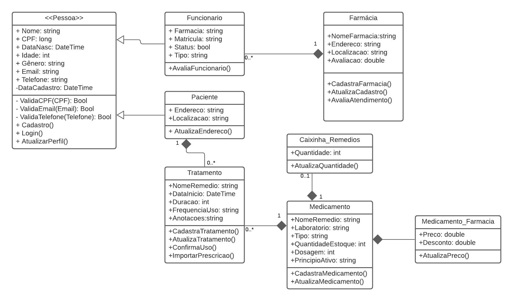
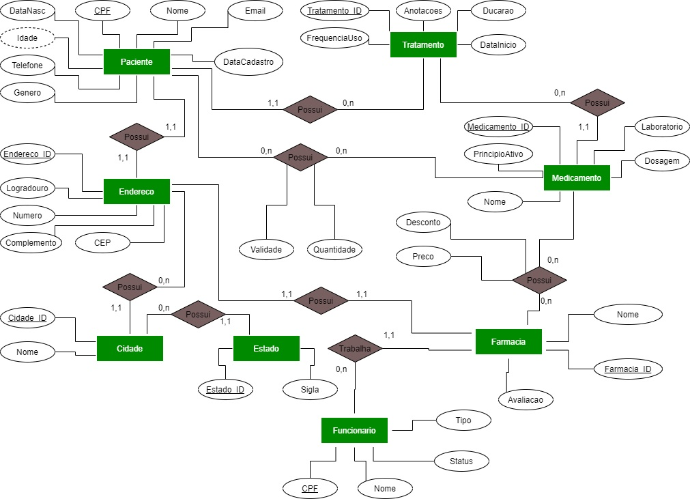
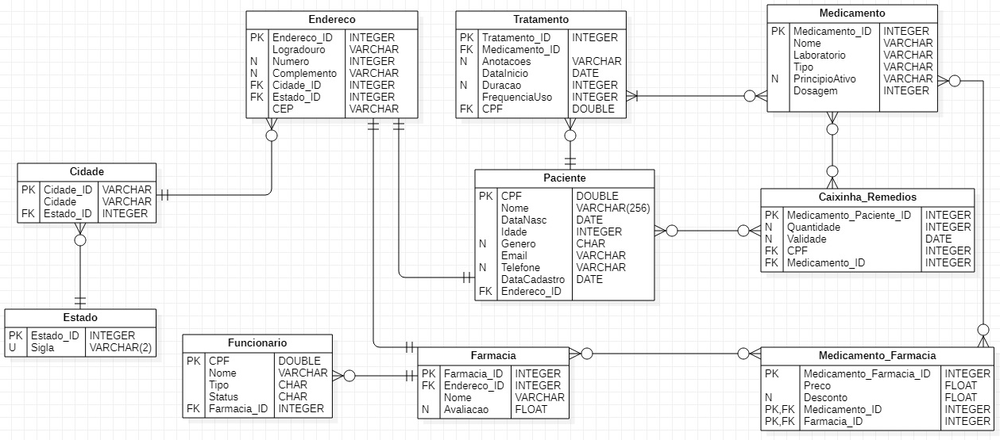
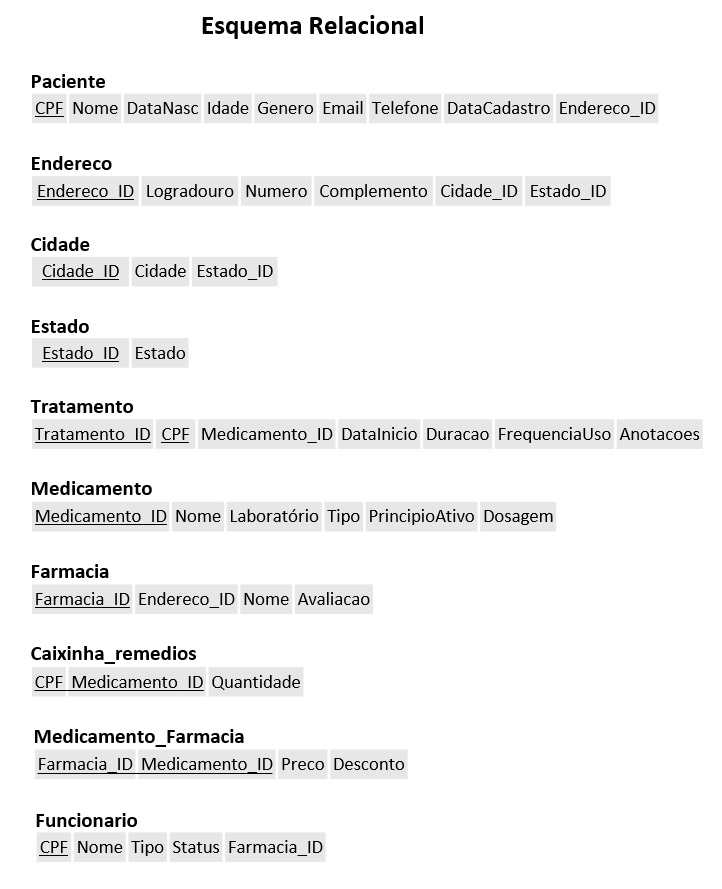

# Arquitetura da Solução

Pré-requisitos: <a href="3-Projeto de Interface.md"> Projeto de Interface</a>

Definição de como o software é estruturado em termos dos componentes que fazem parte da solução e do ambiente de hospedagem da aplicação.

## Diagrama de Classes

O diagrama de classes ilustra graficamente como será a estrutura do software, e como cada uma das classes da sua estrutura estarão interligadas. Essas classes servem de modelo para materializar os objetos que executarão na memória.

## Diagrama ER

O Diagrama Entidade-Relacionamento (DER) representa através de um diagrama como as entidades se relacionam entre si na aplicação interativa.

Também foi elaborado o Diagrama Entidade-Relacionamento conhecido como "pé-de-galinha", que tem melhor visualização dos tributos de cada entidade e seus tipos e da cardinalidade dos relacionamentos,

## Esquema Relacional

O Esquema Relacional corresponde à representação dos dados em tabelas juntamente com as restrições de integridade e chave primária.
 
As referências abaixo irão auxiliá-lo na geração do artefato “Esquema Relacional”.

## Tecnologias Utilizadas

>* Repositório de código fonte: `GitHub`
>* Documentos do projeto: `Google Drive`
>* Interface e Wireframes: `Figma`
>* Diagramas: `LucidChart`
>* Editor de diagramas UML
>   * Diagrama de Casos de Uso e Diagrama de Classes: `LucidChart`
>   * Diagrama Entidade-Relacionamento "pé de Galinha": `StarUML`
>   * Diagrama Entidade-Relacionamento: `Draw.io`
>   * Modelo Relacional: `MS PowerPoint`
>   * Diagrama de Fluxo de Dados: `InDesign`
>* Gerenciamento do projeto: `GitHub`
>* Editor de código: `Visual Studio Code`
>* Ferramentas de desenho de tela: `Figma`
>* Ferramentas de comunicação: `WhatsApp`, `Teams`