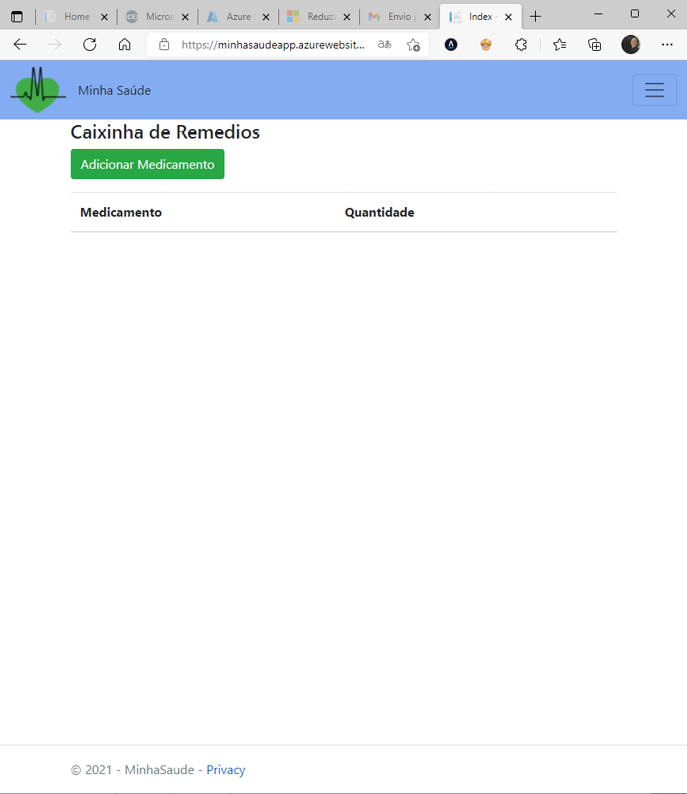

# Registro de Testes de Software

**Caso de Teste**|**CT-01 – Validar tela de login**|
|-----------------|---------------------------------|
|**Requisitos Associados**|RF-14 - O sistema deve apresentar na página principal uma área de login e a opção para se cadastrar novo usuário.|
|**Objetivo do Teste**|Verificar se os campos do formulário estão sendo exibidos corretamente.|
|**Passos**|Acessar o Navegador; Informar o endereço do Site; Visualizar a página de login; Preencher e-mail no campo indicado; Preencher senha no campo indicado; Clicar em ‘Login’.|
|**Critérios de Êxito**|O campo email deve verificar se o usuário digitou uma informação válida; O texto preenchido no campo de senha deve ser oculto; Ao clicar em ‘login’ será direcionado para home.|
|**Resultado**|A Aplicação se comportou conforme esperado.|
|Imagem 1| |
|Imagem 2| |
|Imagem 3| |
|Imagem 4| |

|**Caso de Teste**|**CT-02 – Cadastro de novo usuário**|
|-----------------|---------------------------------|
|**Requisitos Associados**|RF-04 - O sistema deve apresentar 1 formulário de cadastro para novo usuário com 3 perfis (um para cliente, outro para administrador e outro para o funcionário da farmácia) contendo: Nome, e-mail, nome da farmácia (se funcionário), senha.|
|**Objetivo do Teste**|Verificar se os campos do formulário de cadastrar novo usuário está validando os campos corretamente conforme seu respectivo dado.|
|**Passos**|Acessar a primeira tela do site pelo browser, conforme CT-01; Clicar na opção “Cadastro”; Preencher os campos necessários do formulário; Navegar pelo fluxo de cadastro seguindo os passos orientados na tela e clicar em “Salvar”.|
|**Critérios de Êxito**|Na tela de cadastro, ofuncionário da farmácia deve preencher todos os campos (Nome, Email, Nome da Farmácia, Senha), já o cliente e o admin devem preencher somente os campos "Nome", "Email" e "Senha", conforme indicado; apenas uma opção de perfil deve ser selecionada (“Cliente”/”Admin”/"Funcionário") para que tenha um direcionamento correto após o login de cada usuário; também deve ser verificado se o e-mail digitado é válido; Ainda nesta tela, o campo de senha deve manter a informação digitada oculta; Ao clicar em Salvar, o usuário deve ser direcionado para a página de Login.|
|Imagem 1| |
|Imagem 2| |
|Imagem 3| |
|Imagem 4| |
|Imagem 5| |
|Imagem 6 (Direcionamento após conclusão do cadastro)| |

|**Caso de Teste**|DELETAR  **CT-03 – Cadastro de Nova Senha**  DELETAR| 
|-----------------|---------------------------------|
|**Requisitos Associados**|RF-15 - O sistema deve conter um formulário que permita ao usuário cadastrar uma nova senha em caso de esquecimento;|
|**Objetivo do Teste**|Verificar se os campos do formulário estão sendo exibidos corretamente.|
|**Passos**|Acessar o Navegador; Informar o endereço do Site; Visualizar a página de login; Clicar na opção “Esqueci minha senha”; Na tela “Recuperação de acesso”, inserir o e-mail cadastrado; Clicar no botão “próximo”; Na tela de “Código”, preencher no espaço indicado com o código recebido no e-mail de reset da senha; Clicar em “Próximo”; Inserir nova senha nos campos “senha” e “confirmação de senha”; Clicar no botão ‘Concluir’ que levará para a próxima tela.|
|**Critérios de Êxito**|Campo e-mail deve ser preenchido e deve verificar se o usuário digitou uma informação válida; O e-mail com o código deve ser recebido no endereço cadastrado e indicado; O campo de código deve verificar se o código informado é válido; Os campos de senha devem validar se a primeira senha digitada corresponde à segunda; Ao concluir, deve aparecer a mensagem de Senha cadastrada com sucesso.|

|**Caso de Teste**|**CT-04 – Tela Perfil**|
|-----------------|---------------------------------|
|**Requisitos Associados**|RF-12 – O sistema deve permitir enviar prescrição eletrônica; RF-16 - O site deve conter área logada com acesso ao perfil de cada usuário cadastrado, que deverá mostrar o conteúdo apropriado; RF-17 - A tela Perfil deve contemplar informações importantes para ambos os tipos de usuários como: Tratamentos, Medicamentos, Menor preço de medicamentos (em breve), Cadastrar medicamento, Visualizar receita, Cadastrar tratamento (Considerando o tipo de cada perfil).|
|**Perfil**|Cliente|
|**Objetivo do Teste**|Verificar se após o login é exibido a tela principal do perfil logado|
|**Passos**|Acessar o Navegador; Informar o endereço do Site; Visualizar a página principal; Clicar em Login; Preencher o email e a senha; Verificar a página principal do perfil.|
|**Critérios de Êxito**|Ser direcionado automaticamente para a tela principal após o formulário de login; Na tela principal deve aparecer as seguintes informações/funcionalidades no menu: "Home", "Cliente" e "Sair". Ao clicar em "Cliente", deve aparecer o perfil do cliente com as seguintes funcionalidades: Botão “Tratamentos”; Botão “Caixinha de Remédios”; Botão “Pesquisar preços (Em breve)”; Botão “Visualizar Receitas (Em breve)” e Botão “Importar/Exportar Receita (Em breve)”; Em "Tratamento", é apresentada a lista de tratamentos e a opção "Adicionar Tratamento"; Em "caixinha de Remédios", é apresentada uma lista de medicamentos cadastrados pelo usuário logado e a opção "Adicionar Medicamento" para quando houver necessidade. Na tela de perfil "Funcionário" deverá conter o link para a lista de medicmanetos, após clicar em lista de medicamentos deverá conter uma nova página com a lista de todos os medicmaentos cadastrados.
|Imagem 1| |
|Imagem 2| |
|Imagem 3| |
|Imagem 4| |
|Imagem 5| |

|**Caso de Teste**|**CT-05 – Tela Perfil**|
|-----------------|---------------------------------|
|**Requisitos Associados**|RF-12 – O sistema deve permitir receber e encaminhar prescrição eletrônica (Importar e exportar); RF-16 - O site deve conter área logada (Perfil) que conforme o logon de cada perfil (paciente / Funcionário da farmácia) que deverá mostrar o conteúdo apropriado; RF-17 - A tela Perfil deve contemplar informações importantes para ambos os tipos de usuários como: Tratamentos, Medicamentos, Menor preço de medicamentos, Cadastrar medicamento, Visualizar receita, Cadastrar tratamento (Considerando o tipo de cada perfil).|
|**Perfil**|Funcionário da Farmácia (Atendente/Farmacêutico)|
|**Objetivo do Teste**|Verificar se após o login é exibido a tela principal do perfil.|
|**Passos**|Acessar o Navegador; Informar o endereço do Site; Visualizar a página principal; Clicar em Login; Preencher o CPF e a senha; Verificar a página principal do perfil.|
|**Critérios de Êxito**|Ser direcionado automaticamente para a tela principal após o formulário de login; Na tela principal deve aparecer as seguintes informações/funcionalidades: Botão; Botão “Medicamentos”; Botão “Importar/Exportar arquivo”.|
|Imagem 1| |
|Imagem 1| |
|Imagem 2| |

|**Caso de Teste**|**CT-06 – Cadastro Tratamento**|
|-----------------|---------------------------------|
|**Requisitos Associados**|RF-02 – O sistema deve possuir um banco de dados de medicamentos para seleção do usuário no cadastro de tratamento; RF-03 - O sistema deve permitir cadastro de tratamento, incluindo: nome do medicamento, dosagem, horários de ingestão e duração do tratamento; RF-11 – O sistema deve permitir a inserção e a leitura de bulas de medicamentos.|
|**Perfil**|Cliente|
|**Objetivo do Teste**|Verificar se as opções de cadastro estão sendo exibidas e executadas corretamente.|
|**Passos**|Na tela Perfil, clicar no botão “Tratamentos”; Na tela tratamentos, clicar no botão “Novo Tratamento”; Na opção Medicamento, ao digitar deverá permitir a expansão, caso o medicamento já esteja no banco de dados; Selecionar o ‘Nome do Medicamento’; Preencher os campos ‘Data Início’, ‘Duração’, ‘Frequência de Uso’ e ‘Anotações’;  Campo ‘Anotações’ não precisará ser obrigatório; e Clicar no botão ‘Enviar’ para salvar o cadastro.|
|**Critérios de Êxito**|Os campos para preenchimento deverão permitir a entrada de dados; O preenchimento do nome do medicamento deve funcionar, caso o medicamento esteja cadastrado no banco de dados; O usuário deverá conseguir salvar as informações inseridas mesmo com o campo ‘Anotações’ em branco; Após clicar em “Enviar”, deve-se retornar automaticamente para a tela “Tratamentos”; O tratamento cadastrado deve estar relacionado nos tratamentos desta tela; A bula deve estar disponível para leitura.|
|Imagem 1| |
|Imagem 2| |
|Imagem 3| |
|Imagem 4| |
|Imagem 5| |

|**Caso de Teste**|**CT-07 – Cadastro Medicamento**|
|-----------------|---------------------------------|
|**Requisitos Associados**|RF-01 - O sistema deve ter um cadastro de medicamentos, incluindo: nome, laboratório, dosagem, tipo (comprimido, gota, ampola, etc); RF-11 – O sistema deve permitir a inserção e a leitura de bulas de medicamentos;
|**Perfil**|Paciente|
|**Objetivo do Teste**|Verificar se as opções de cadastro estão sendo exibidas e executadas corretamente.|
|**Passos**|Acessar o Navegador;  Na tela Perfil, clicar no botão “Lista de medicamnetos”; Na tela Medicamentos, clicar no botão “Novo Medicamento”; Na tela de Cadastro de medicamento, clicar no botão “cadastro de medicamento”; Preencher os campos de ‘Nome do Medicamento’, ‘Laboratório’, ‘Tipo’, ‘Dosagem’, ‘Princípio Ativo’;  Clicar no botão ‘Cadastrar’.|
 |**Critérios de Êxito**|Os campos para preenchimento deverão permitir a entrada de dados; Após clicar em Cadastrar, deve-se retornar automaticamente para a tela Cadastrar Tratamento, com o medicamento cadastrado já selecionado; |
|Imagem 1| |
|Imagem 2| |
|Imagem 3| |
|Imagem 4| |

|**Caso de Teste**|**CT-08 – Atualização da “Caixinha de Remédios”**|
|-----------------|---------------------------------|
|**Requisitos Associados**|RF-05 – O sistema deve permitir cadastro de Caixinha de medicamentos, com quantidade alterada quando usuário confirma a ingestão; RF-06 – O cadastro de Caixinha deve incluir data de validade e lote.|
|**Perfil**|Paciente|
|**Objetivo do Teste**|Verificar o cadastro de quantidade, data de validade e lote na tela de CAIXINHA|
|**Passos**|Acessar o navegador; Informar o endereço do Site; Realizar o login; Acessar a seção Caixinha de Remédios; Selecionar o Medicamento desejado e clicar em “Alterar quantidade”; Nos campos QUANTIDADE, DATA DE VALIDADE E LOTE DO MEDICAMENTO inserir dados válidos; Clicar em salvar.|
|**Critérios de Êxito**|Após clicar em salvar, deve retornar automaticamente para a tela Caixinha de Remédios;Ao retornar para a Caixinha de Remédios, Cadastrar a quantidade, data de validade e lote e consultá-lo posteriormente pelo menu de buscas de produtos.|
|Imagem 1| )|
|Imagem 2| |
|Imagem 3| |
|Imagem 4| |

|**Caso de Teste**|**CT-09 – Importar e exportar prescrição**|
|-----------------|---------------------------------|
|**Requisitos Associados**|RF-12 – O sistema deve permitir receber e encaminhar prescrição eletrônica (Importar e exportar)|
|**Perfil**|Paciente|
|**Objetivo do Teste**|Verificar o cadastro, envio e recebimento de prescrição.|
|**Passos**|Acessar o navegador; Informar o endereço do Site; Realizar o login; Clicar no botão “Importar/Exportar arquivo”; Selecionar o arquivo da prescrição; Clicar em ENVIAR.|
|**Critérios de Êxito**|Cadastrar data de validade e lote e consultá-lo posteriormente pelo menu de buscas de produtos.|

|**Caso de Teste**|**CT-10 – (DELETAR) Pesquisa de preços**|
|-----------------|---------------------------------|
|**Requisitos Associados**|RF-09 – O sistema deve ter um sistema de localização de farmácias (pode ser pelo Google Maps), considerando a localização atual do usuário; RF-10 - O sistema deve permitir a comparação de preços de um medicamento selecionado entre diversas farmácias; RF-13 – O sistema deve permitir o registro da qualidade do atendimento das farmácias para futura comparação.|
|**Perfil**|Paciente|
|**Objetivo do Teste**|Verificar se as opções da pesquisa foram preenchidas corretamente.|
|**Passos**| Acessar o Navegador; Informar o endereço do Site; Acessar a página ‘Pesquisa de preço’; Visualizar o campo de preenchimento relativo ao nome do medicamento; Campo ‘Busca de medicamento’ deve estar acessível para preenchimento; Clicar na lupa para efetuar a busca; Ao buscar o medicamento, o aplicativo deve possuir um sistema de localização que permita mostrar as farmácias mais próximas da residência do usuário; Em seguida deve apresentar várias farmácias onde o medicamento encontra-se disponível e cada uma com o preço praticado; O ícone da farmácia deve ser um link de redirecionamento para a mesma, possibilitando ao paciente comprar o medicamento on-line, e, caso deseje, fornecer o endereço físico para compra presencial; O sistema deve apresentar uma opção de avaliação do atendimento após a compra realizada com notas de 0 (para muito ruim) a 5 (para muito bom).|
|**Critérios de Êxito**|Os campos para preenchimento deverão permitir a entrada de dados; Os links das farmácias devem estar disponíveis para redirecionamento; O aplicativo deve apresentar as distâncias das farmácias da pesquisa, mostrando primeiro as mais próximas de sua residência; A opção de avaliação de qualidade deve apresentar o resultado da avaliação feita pelo usuário.|

|**Caso de Teste**|**CT-11 - (DELETAR) Notificações**|
|-----------------|---------------------------------|
|**Requisitos Associados**|RF-05 – O sistema deve permitir cadastro de Caixinha de medicamentos, com quantidade alterada quando usuário confirma a ingestão; RF-07 – O sistema deve emitir alerta com notificação nos horários de ingestão cadastrados na posologia; RF-08 – O sistema deve emitir alerta de quantidade baixa de medicamento, considerando a quantidade definida pelo usuário (“quando quantidade for menor que X comprimidos”).|
|**Perfil**|Paciente|
|**Objetivo do Teste**|Verificar se o sistema de alarmes do aplicativo está funcionando corretamente|
|**Passos**|Acessar o navegador; Informar o endereço do Site; Realizar o login; Acessar a seção Notificações; Selecionar a opção “Notificação de ingestão”; Deve apresentar uma tela para marcar horário de ingestão de cada medicamento (tendo a opção de adicionar quantos medicamentos forem necessários) e clicar em “Repetir todos os dias”; Clicar em salvar; Depois que soar o alarme, deve apresentar uma opção de confirmação de ingestão; Selecionar a opção “Notificação de Caixinha”; Deve apresentar uma tela para marcar a quantidade mínima de cada medicamento (tendo a opção de adicionar quantos medicamentos forem necessários) para soar o alarme; Clicar em salvar; Selecionar a opção “Notificação de afastamento de casa”; Deve apresentar uma tela para ativar localização e distância que o alarme deve disparar; Clicar em salvar.|
|**Critérios de Êxito**|O alarme deve soar nos horários definidos para cada medicamento e apresentar uma notificação do que deverá ser consumido; Depois de soado o alarme, apresentar a tela para confirmar ingestão; O alarme deve soar quando o nível do medicamento alcançar o nível registrado; O alarme deve soar quando ultrapassar a distância da residência definida no registro de “Notificação de afastamento de casa”.|

